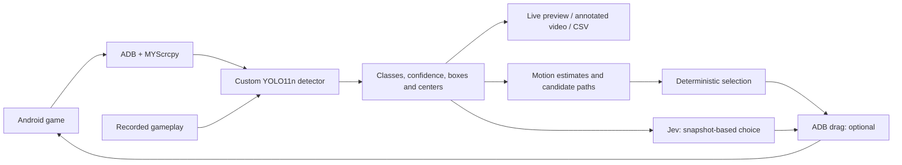

# Realtime Vision Decision Agent

A vision pipeline for playing an Android raindrop-collection game. A custom
YOLO11n model detects droplets, bombs, and the watering can, providing object
positions for deterministic or Jev-driven game control.

**Current status:** the v3 detector and both control modes have been exercised in
live gameplay. The deterministic planner supports full-width moves and
catch-and-escape sequences. Its latest changes—a shallower mouth hitbox and
center-based catch alignment—have passed offline tests and await the next live
session. Both detection scripts use `models/raindrops-yolo11n-v3.pt` at confidence
**0.25**.

The initial Jev run hit three bombs. A later deterministic run with full-width
moves and catch-and-escape planning hit one bomb and collected more droplets,
according to manual observation. These are individual runs with evolving
controllers, not a controlled benchmark. See the [test plan and results log](docs/gameplay-testing.md)
for the next deterministic/Jev trials and evidence to collect before sharing results.

## Architecture



| Component | Role |
| --- | --- |
| scrcpy | Mirror the phone and record gameplay |
| ADB | Connect to the Android device |
| MYScrcpy | Supply Android screen frames to the live Python script |
| Ultralytics YOLO + PyTorch | Train and run the custom object detector |
| Roboflow | Annotate images and version the training dataset |
| OpenCV + PyAV | Process frames, display predictions, and encode H.264 video |
| Local planner | Motion estimation, mouth collisions, catch-and-escape choices |
| Typesafe AI Jev | Optional left/right/hold decisions from detected objects |

## Model and results

The v3 model was trained from pretrained YOLO11n weights using **130 annotated
images** in Roboflow dataset version 3. It recognizes four classes:

| Class | Meaning |
| --- | --- |
| `bomb` | Hazard to avoid |
| `droplet` | Collectible single or double droplet sprite; one box per collectible |
| `watering_can` | Normal player-controlled can |
| `disabled_watering_can` | Can showing the translucent/flashing state after a bomb hit |

Training used 640-pixel inputs, batch size 16, a maximum of 150 epochs, and
validation with early-stopping patience 30. The best checkpoint was at **epoch
76**; training stopped at epoch 106. The saved v3 model comes from
`runs/detect/train5/weights/best.pt`.

Validation results on **26 images / 171 labeled objects**:

| Class | Instances | Precision | Recall | mAP50 | mAP50–95 |
| --- | ---: | ---: | ---: | ---: | ---: |
| All classes | 171 | 0.977 | 0.971 | 0.993 | 0.903 |
| Bomb | 39 | 0.973 | 0.907 | 0.989 | 0.835 |
| Disabled watering can | 1 | 0.961 | 1.000 | 0.995 | 0.995 |
| Droplet | 106 | 1.000 | 0.975 | 0.995 | 0.896 |
| Watering can | 25 | 0.975 | 1.000 | 0.995 | 0.888 |

Precision measures false-alarm avoidance; recall measures how many labeled
objects are found. mAP50 evaluates detections at an overlap threshold of 0.50;
mAP50–95 averages over stricter overlap thresholds. Reported precision and recall
use the validation-selected confidence operating point, not necessarily 0.25.
The disabled-can result has only one validation example. Fresh gameplay remains
the practical test of generalization and live performance.

## Setup

The current environment targets **macOS / Apple Silicon**, with Python 3.13+
and [uv](https://docs.astral.sh/uv/). Run commands from the repository root.

```bash
brew install scrcpy android-platform-tools
uv sync
```

The v3 checkpoint is included at `models/raindrops-yolo11n-v3.pt`. Recordings and
local dataset exports are not included in the repository.

For live capture, enable USB debugging on the Android phone, connect it by USB,
and accept the phone's debugging authorization prompt. Check the connection:

```bash
adb devices
```

The phone should appear with status `device`. To mirror it for manual play:

```bash
scrcpy
```

## Live detection

With the phone connected and the game open:

```bash
uv run python testYolo.py
```

The script connects to the first available ADB device and displays bounding boxes,
class names, confidence scores, center coordinates, and processing FPS. Press
**Q** in the preview or **Ctrl+C** in the terminal to stop.

Capture is capped at 30 FPS and a longest dimension of 1280 pixels. YOLO runs with
`imgsz=640` and confidence 0.25. The live queue keeps the newest frame to avoid
accumulating lag. Coordinates refer to the captured frame, not necessarily the
phone's native resolution. By default the script only displays detections. Enable a decision mode and control explicitly
as described below.

## Deterministic controller

Run the local planner without an API key:

```bash
uv run python testYolo.py --deterministic
```

Add `--control` to execute its chosen drags:

```bash
uv run python testYolo.py --deterministic --control
```

This mode is mutually exclusive with `--jev`. Both modes start paused; focus the
preview and press **J** to start/pause. Deterministic sessions record to
`runs/deterministic/<timestamp>/annotated.mp4`, with a `decisions.jsonl` file
containing tracks, candidate metrics, and each selected choice. A cyan vertical
line marks the proposed destination. Logged choices are proposals, not confirmation
that Android executed them: while a drag is running, new proposals are not queued.

The logic is separated for review:

- **`choice_preprocessor.py`** associates same-class falling objects across frames,
  estimates downward speed, retains tracks through short gaps, and generates hold,
  droplet-alignment, and bomb-avoidance destinations across the full playable width.
  It calculates swept-box collisions over a one-second horizon, including
  catch-and-escape sequences and possible second catches.
- **`deterministic_controller.py`** chooses the earliest predicted safe catch, preferring more
  catches when the first-catch timing is equivalent, then less total travel.
  Without a catch, it chooses the safe option requiring least movement. If every candidate predicts a bomb hit,
  it chooses the option delaying that hit longest and displays `NO SAFE MOVE`.

A candidate may specify an initial destination plus an escape destination and
escape time. Only the initial drag is sent immediately. The controller retains
the escape deadline (so repeated replanning cannot postpone it indefinitely),
rechecks the escape against fresh detections when due, and abandons it if it is
no longer predicted safe. Toggle J to clear a pending sequence. JSONL candidate
records include `escape_target_x`, `escape_at` (relative to the snapshot),
`escape_duration`, and `catch_count` for review. Only one Android drag runs at a
time; an executing drag cannot be interrupted.

There is no longer a 35%-width movement cap. Default estimated drag speed is
**3 screen widths/second**, with a minimum drag duration of 80 ms, an input delay
of 80 ms, and 120 ms reserved for observation/control turnaround before escape.
These are provisional estimates, not measured phone physics. Tune speed and input
delay if the recorded movement does not match the predictions:

```bash
uv run python testYolo.py --deterministic --control --drag-speed 3 --input-delay 0.08
```

`PlannerConfig` holds the explicit assumptions: fall speed before a track has two
observations, drag speed, input delay, margins, and planning horizon. The current
model assumes vertical constant-speed objects, a stationary can height, linear
drags, a mouth-only hazard/catch rectangle derived from the marked screenshot. It treats a
disabled can as vulnerable. These are initial approximations, not measured game
physics. Unknown objects, association mistakes, and missed detections can still
cause collisions. Missing-can frames suppress control; observations older than
250 ms are not executed. Old tracks reset when J is toggled.

Offline tests cover path collisions, catches, tracking gaps, missing/disabled cans,
and all-unsafe choices. Live calibration of touch movement and collision regions
is still needed. The Jev mode retains its original left/right/hold policy; it does
not yet consume these candidate choices, leaving the deterministic baseline
independently reviewable.

### Mouth hitbox calibration

The deterministic planner derives the mouth from the whole-can YOLO box using
`PlannerConfig` fractions: left **0.33**, top **0.06**, right **0.76**, bottom
**0.18**. The original screenshot-derived bottom was 0.30; it is now moved
upward to halve the height while keeping the top fixed. The original reference is
[`images/Screenshot_with bounding box.jpg`](images/Screenshot_with%20bounding%20box.jpg).
The planner draws this region in red in the live preview and session video.
A yellow inner rectangle marks the central 25% of the mouth width: a droplet
center must enter this band while vertically overlapping the mouth to count as
a predicted catch. This applies to both single and double sprites; touching the
mouth with just the sprite edge is no longer enough. Destinations still align
the mouth center exactly with the droplet center, with corrective moves based
on fresh observed can positions if a prior swipe stopped short.

Bombs retain full bounding-box overlap checks. Their vertical safety padding is
separately configurable as `vertical_margin=0.004` of screen height, versus
`margin=0.015` horizontally. This prevents the old vertical padding from
negating the smaller mouth height.
Candidate destinations remain body-center coordinates for dragging, but compensate
for the mouth's horizontal offset when aiming. Drags still begin at the body.

Bomb collisions and droplet catches are evaluated against the mouth rectangle.
Bombs fully below the mouth (including the configured safety margin) no longer
block a move merely because they overlap the body. Screen-edge constraints still
use the full can. These screenshot-derived fractions are an initial calibration;
verify them across normal/disabled appearances and against actual collisions.
The existing Jev snapshot policy is unchanged.

## Jev decisions and drag control

Create a key in the [TypeSafe console](https://console.typesafe.ai/) and put it in
the repository-root `.env` file (ignored by Git):

```dotenv
JEV_API_KEY=your_key_here
```

`testYolo.py` loads this file automatically. Existing environment variables are
not overwritten. `JEV_API_KEY` takes priority over the SDK's `TYPESAFE_API_KEY`
alias. Do not commit real keys. Alternatively, to use a terminal-session key
without putting its value in shell history, in zsh run:

```zsh
read -rs 'TYPESAFE_API_KEY?TypeSafe API key: '; echo
export TYPESAFE_API_KEY
```

Start with advice displayed in the preview:

```bash
uv run python testYolo.py --jev
```

To apply decisions as short horizontal drags beginning at the detected can:

```bash
uv run python testYolo.py --jev --control
```

Jev starts **paused**, with no API requests or drags. Navigate to the game on
the phone, click the YOLO preview window to focus it, and press **J** to start.
Press **J** again to pause; YOLO detection continues. Responses from before a
pause are discarded. A drag already executing may finish before movement stops.
Keep the phone orientation fixed, and quit with Q or Ctrl+C.

Each press of **J** to start also begins a new H.264 recording at
`runs/jev/<timestamp>/annotated.mp4`. Pressing **J** to pause finalizes that file;
starting again creates a separate session. Q, Ctrl+C, and normal error cleanup
also finalize an active recording. A red REC timer appears in the preview.
Recordings contain the annotated YOLO preview, including confidence scores and
Jev recommendations, with no audio. This works in advice-only mode too.

Live recordings use elapsed-time timestamps, so variable detection speed is
preserved in playback. They include processed preview frames, not every raw
phone frame; slow inference can still make motion look choppy. Encoding uses an
ultrafast H.264 preset to limit overhead. Session files are ignored by Git under
`runs/`.

Jev control uses an 8%-of-screen-width step over 120 ms. It is an
initial controller to tune against the actual game, not a calibrated collision
planner. Each drag releases the touch before the next decision.

Only structured detections (classes, confidence, normalized boxes and centers)
are sent to the TypeSafe API, not screenshots. Jev chooses `left`, `right`, or
`hold` using `jev-latest`. Requests run in the background with at most one in
flight, at most once per 0.5 seconds (`--jev-interval` changes this). The preview
shows the recommendation, confidence, and observed request latency. API use may
consume account credits.

Decisions older than 1.5 seconds are discarded; missing-can frames suppress
movement. API failures pause requests for five seconds. No SDK retries are made
for an old snapshot. The initial policy uses one snapshot, without velocity
estimation or a persistent disabled-state timer, so evaluate its decisions before
relying on autonomous play. No live API or phone-control validation is included
in the offline tests.

## Record gameplay

```bash
mkdir -p recordings
scrcpy \
  --no-audio \
  --video-codec=h264 \
  --video-bit-rate=16M \
  --max-fps=30 \
  --record=recordings/gameplay-01.mp4
```

Play on the phone or through the mirrored window. Press **Ctrl+C** in the terminal
to finish recording. Use a new filename for each run. Recording does not require
running either YOLO script.

## Replay a recording through YOLO

No phone connection is needed:

```bash
uv run python testYoloVideo.py recordings/gameplay-01.mp4 --show
```

**Space** pauses/resumes the preview; **Q** or **Escape** stops it. Omit `--show`
to process without a window. Every decoded frame is processed; the preview may
run slower than real time if inference cannot keep up.

Useful options:

| Option | Default | Purpose |
| --- | --- | --- |
| `--model` | `models/raindrops-yolo11n-v3.pt` | Select a checkpoint |
| `--conf` | `0.25` | Minimum detection confidence |
| `--imgsz` | `640` | YOLO inference size |
| `--max-size` | `1280` | Cap the input frame's longest side; `0` keeps source size |
| `--device` | Automatic | Choose `cpu`, `mps`, or a CUDA device index |
| `--start` | `0` | Start at this time in seconds |
| `--max-frames` | `0` | Limit processed frames; `0` runs to the end |
| `--output-dir` | New folder under `runs/video/` | Must be a new directory |

For a short, repeatable comparison:

```bash
uv run python testYoloVideo.py recordings/gameplay-01.mp4 \
  --start 10 --max-frames 150 --conf 0.25 --show
```

Use `--model runs/detect/train5/weights/best.pt` to test a local training checkpoint
directly. Keep the video segment and confidence threshold identical when comparing
models. Lowering `--conf` to `0.05` is useful for investigating missed detections,
but also admits more false-positive candidates.

Each run saves:

- **`annotated.mp4`** — H.264 video with boxes, class names, confidence scores, and
  source frame number. PyAV encodes with `libx264`, `yuv420p`, and MP4 fast-start.
- **`detections.csv`** — source frame/time, resized frame dimensions, class,
  confidence, box corners, and center coordinates for each detection.

CSV coordinates are in the resized frame's pixel space. Frames without detections
have no CSV rows. Console totals count detections across frames, not unique objects.
Odd video dimensions receive one black padding pixel on the right/bottom without
changing CSV coordinates. Exported video has no audio and uses the source's average
frame rate; use CSV source timestamps when analyzing variable-rate recording timing.

## Train another model

Launch the notebook:

```bash
uv run jupyter notebook
```

Open `train_yolo_model.ipynb`, select the intended Roboflow dataset version, and
supply your own Roboflow API key locally. Keep credentials out of committed notebook
source and outputs. Training logs are retained in the notebook to document the run.

The v3 training configuration was:

```python
model = YOLO("yolo11n.pt")
results = model.train(
    data=f"{dataset.location}/data.yaml",
    epochs=150,
    patience=30,
    batch=16,
    imgsz=640,
    device=device_target,
    val=True,
)
```

The notebook selects MPS when available, otherwise CPU. With Ultralytics 8.3.189,
the default automatic optimizer chooses the learning rate. For new datasets, label
all target objects in each selected image and reserve separate gameplay sessions
for validation/test where possible.

### Resume after an MPS training error

The v3 run encountered an MPS shape-mismatch error during training. It was resumed
successfully on CPU from the last completed epoch. After restarting the notebook
kernel, use the interrupted run's checkpoint:

```python
from ultralytics import YOLO

model = YOLO("runs/detect/train5/weights/last.pt")  # Replace with the interrupted run.
results = model.train(resume=True, device="cpu")
```

This applies to an interrupted checkpoint that still contains optimizer state.
Completed runs have that state stripped. For deployment, select `best.pt`, test it
on recordings, and copy it into `models/` under a new versioned filename. Update
both detection scripts when promoting a model.

## Repository contents

| Path | Purpose |
| --- | --- |
| `testYolo.py` | Live detection, deterministic/Jev modes, drag control, and J-toggle recording |
| `choice_preprocessor.py` | Object motion estimates, candidate paths, and predicted outcomes |
| `deterministic_controller.py` | Local candidate selection and escape scheduling |
| `video_writer.py` | Shared H.264 encoder for replay and live session recordings |
| `jev_agent.py` | Background API requests, state conversion, and drag controller |
| `testYoloVideo.py` | Recorded-video detection, H.264 export, and CSV export |
| `train_yolo_model.ipynb` | Dataset download, training, and saved training logs |
| `models/raindrops-yolo11n-v3.pt` | Current custom detector |
| `tests/` | Offline planner, SDK/drag, and video encoding tests |
| `docs/gameplay-testing.md` | Next-session procedure and manual results log |
| `pyproject.toml`, `uv.lock` | Dependencies and locked environment |
| `recordings/`, `Collect-Raindrops-*/`, `runs/` | Local recordings, datasets, and generated results; ignored by Git |

Model weights are ignored by default, with an explicit exception for the current
v3 checkpoint. Add an exception when intentionally publishing another model version.

## Verification and next session

Run the offline checks without a phone or API key:

```bash
uv run python -m unittest discover -s tests -v
```

The current 27 tests cover geometry, center alignment, movement correction,
tracking, catch/escape feasibility, pause/stale-response handling, SDK request
formatting with a mock transport, drag coordinates, and H.264 timing. They do not
establish real-game collision accuracy or end-to-end control latency.

Next: test the updated deterministic controller when attempts refresh, then run
Jev again. Follow the [gameplay test plan](docs/gameplay-testing.md) to record the
code revision, settings, final water total, bomb hits, and timestamped misses.
Jev currently receives detections, not the deterministic planner's candidate
sequences; this comparison evaluates the two complete pipelines. Connecting Jev
to the same preprocessed choices is a separate future experiment.
