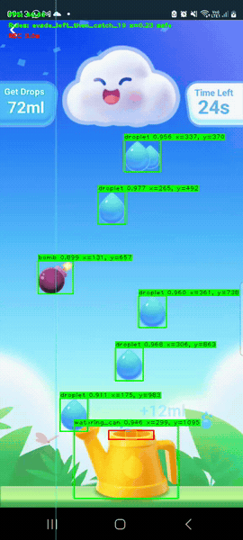
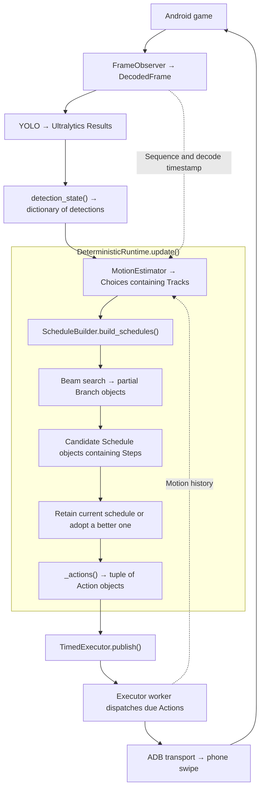

# Realtime Vision Decision Agent



Playing Lazada’s **Catch the Drops** with a custom YOLO11n detector and a local
controller. YOLO finds droplets, bombs, and the watering can; Python predicts
motion, plans catches and dodges, and executes timed drags on an Android phone.
The GIF shows an earlier controller version.

**The main finding:** learned perception plus explicit geometry and timing was
sufficient for a perfect run. Adding Jev to select precomputed routes did not
demonstrate an improvement in this experiment.

## Results and findings

Reviewed runs on **24 September 2026**:

| Mode | Water collected | Bomb hits | Observed result |
| --- | ---: | ---: | --- |
| Deterministic | **456 ml** | **0** | Perfect run, based on manual review |
| Jev-assisted | **396 ml** | **0** | Two missed droplets |

These are individual runs with different game layouts, **not a controlled
benchmark**. Jev mode also uses local planning, safety checks, and fallback control.

- **Timing and geometry mattered.** Planning around the can’s mouth, projecting
  delayed observations, and executing queued actions independently of inference
  made fast catches and dodges possible.
- **Jev chose sensible options.** All 27 responses selected a route tied for the
  highest predicted catch count. Only 22 of 64 dispatched drags came from
  accepted Jev plans; the rest came from local control.
- **The integration restricted opportunities.** It retained valid Jev plans and
  reserved time for API responses. Offline reconstruction found repeated catch
  opportunities for the second missed droplet that deterministic replanning
  would schedule, but Jev mode did not. The first miss was less conclusive.

This supports using a deterministic policy for this game. It does **not** show
that Jev misunderstood the state or that deterministic control is universally
better. See the [Jev implementation and review](docs/jev-policy.md).

## How it works



1. YOLO produces fresh detections as frames are processed. It identifies the watering can, droplets, and bombs.
2. `choice_preprocessor.py` tracks objects and calculates the can’s mouth hitbox. `motion_estimator.py` estimates their current positions, accounting for delayed images and movements already commanded.
3. The runtime checks whether the current plan is still valid. It searches for improvements every 150 ms, or sooner when the plan becomes invalid.
4. `rolling_planner.py` searches up to 12 upcoming rows within a four-second horizon. For each row, it explores collecting, skipping, or dodging.
5. Beam search keeps up to eight partial routes at each level, rejecting predicted collisions and infeasible timing. Routes are ranked by most catches, then least travel, then earliest readiness for another action. 
6. The runtime selects the best resulting schedule when replacement is warranted. Otherwise, it retains the current valid plan. Eight is the search width—not necessarily the number of final schedules returned.
7. The selected schedule is converted into timed actions. A separate executor sends the drags when they are due, without waiting for the next observation or planning cycle.
8. The loop repeats, updating future actions as new observations arrive while respecting movements already dispatched.

If Jev is used:

1. YOLO detects objects, and the estimator updates the game state.
2. Local control validates the current plan and handles startup or necessary repairs.
3. Beam search generates up to four candidate schedules for Jev, preserving a near-term portion of the current route to accommodate API latency.
4. Jev receives those schedules and chooses one. Each option includes predicted catches, travel, destinations, and timing. Local execution continues while the request is pending.
5. The runtime revalidates Jev’s selection against fresh observations. It rebuilds the remaining steps and rejects the selection if it is no longer feasible.
6. The runtime converts the accepted schedule into actions, which the timed executor dispatches.

## Setup and play

Developed on **macOS / Apple Silicon**, using Python 3.13+ and
[uv](https://docs.astral.sh/uv/):

```bash
brew install scrcpy android-platform-tools
uv sync
adb devices
```

Enable USB debugging on the phone, connect by USB, and accept its authorization
prompt. The script uses the first available ADB device.

```bash
# Detection preview only
uv run python testYolo.py

# Deterministic gameplay; no API key required
uv run python testYolo.py --deterministic --control
```

For Jev-assisted gameplay, put `JEV_API_KEY=your_key_here` in a repository-root
`.env` file (ignored by Git), then run:

```bash
uv run python testYolo.py --jev --control
```

Both control modes start paused. Navigate to the game, focus the preview, and
press **J** to start control and recording. Press **J** again to stop and finalize
the recording; **Q** exits. There is no fixed session timeout.

Sessions save H.264 `annotated.mp4` and `decisions.jsonl` under
`runs/deterministic/<timestamp>/` or `runs/jev/<timestamp>/`. The cyan line marks
the proposed mouth destination. Omit `--control` to preview decisions without
sending gestures; Jev still makes API requests after J.

## Detector and training

The included checkpoint, `models/raindrops-yolo11n-v3.pt`, was trained using a
Roboflow dataset of **130 annotated images**. Its four classes are `droplet`
(single and double sprites), `bomb`, `watering_can`, and `disabled_watering_can`.
Both detection scripts use confidence **0.25** and image size **640** by default.

Validation on **26 images / 171 objects**: precision **0.977**, recall **0.971**,
mAP50 **0.993**, and mAP50–95 **0.903**. This is a small validation set; the
disabled-can class has only one validation instance.

Training configuration and saved logs are in
[train_yolo_model.ipynb](train_yolo_model.ipynb). Open it with
`uv run jupyter notebook` and supply your own Roboflow key locally. Keep keys out
of committed cells and outputs. The v3 run resumed on CPU after an MPS error;
its best checkpoint was epoch 76.

## Record and inspect gameplay

Record manual play independently of YOLO:

```bash
mkdir -p recordings
scrcpy --no-audio --video-codec=h264 --max-fps=30 --record=recordings/gameplay-01.mp4
```

Stop with Ctrl+C, then run detection on the recording:

```bash
uv run python testYoloVideo.py recordings/gameplay-01.mp4 --show
```

This exports an H.264 annotated video and `detections.csv` under `runs/video/`.
Use `--help` for model, confidence, frame-range, and output options. Recordings,
datasets, and generated runs are ignored by Git; the v3 model is included.

## Tests and implementation

Run offline tests without a phone or API key:

```bash
uv run python -m unittest discover -s tests -v
```

The 107 tests cover planning, delayed observations, queue replacement, Jev
responses, input handling, and video encoding. Synthetic tests do not establish
live-game scores.

| Start here | Purpose |
| --- | --- |
| [testYolo.py](testYolo.py) | Live preview, control modes, and recording |
| [motion_estimator.py](motion_estimator.py) | Account for observation delay and command history |
| [rolling_planner.py](rolling_planner.py) | Search collect, skip, and dodge routes |
| [deterministic_runtime.py](deterministic_runtime.py) / [timed_executor.py](timed_executor.py) | Replan and execute independently |
| [jev_timed_runtime.py](jev_timed_runtime.py) | Asynchronous Jev route selection |

More detail: [timed execution](docs/deterministic-execution.md),
[policy evolution](docs/deterministic-policy-evolution.md), and
[historical testing notes](docs/gameplay-testing.md).
