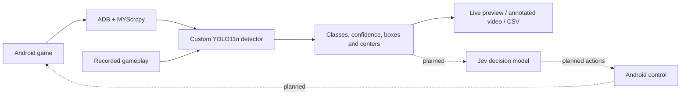

# Realtime Vision Decision Agent

A vision pipeline for playing an Android raindrop-collection game. A custom
YOLO11n model detects droplets, bombs, and the watering can, providing object
positions for a future game-playing agent.

**Current status:** the v3 detector is working well in recorded-gameplay testing.
Both detection scripts use `models/raindrops-yolo11n-v3.pt` at a default confidence
threshold of **0.25**. Live Android capture, recorded-video replay, and annotated
video export are implemented. Jev API integration and autonomous control are next.

## Architecture



| Component | Role |
| --- | --- |
| scrcpy | Mirror the phone and record gameplay |
| ADB | Connect to the Android device |
| MYScrcpy | Supply Android screen frames to the live Python script |
| Ultralytics YOLO + PyTorch | Train and run the custom object detector |
| Roboflow | Annotate images and version the training dataset |
| OpenCV + PyAV | Process frames, display predictions, and encode H.264 video |
| Typesafe AI Jev | Planned decision-making API integration |

## Model and results

The v3 model was trained from pretrained YOLO11n weights using **130 annotated
images** in Roboflow dataset version 3. It recognizes four classes:

| Class | Meaning |
| --- | --- |
| `bomb` | Hazard to avoid |
| `droplet` | Collectible single or double droplet sprite; one box per collectible |
| `watering_can` | Normal player-controlled can |
| `disabled_watering_can` | Can showing the translucent/flashing state after a bomb hit |

Training used 640-pixel inputs, batch size 16, a maximum of 150 epochs, and
validation with early-stopping patience 30. The best checkpoint was at **epoch
76**; training stopped at epoch 106. The saved v3 model comes from
`runs/detect/train5/weights/best.pt`.

Validation results on **26 images / 171 labeled objects**:

| Class | Instances | Precision | Recall | mAP50 | mAP50–95 |
| --- | ---: | ---: | ---: | ---: | ---: |
| All classes | 171 | 0.977 | 0.971 | 0.993 | 0.903 |
| Bomb | 39 | 0.973 | 0.907 | 0.989 | 0.835 |
| Disabled watering can | 1 | 0.961 | 1.000 | 0.995 | 0.995 |
| Droplet | 106 | 1.000 | 0.975 | 0.995 | 0.896 |
| Watering can | 25 | 0.975 | 1.000 | 0.995 | 0.888 |

Precision measures false-alarm avoidance; recall measures how many labeled
objects are found. mAP50 evaluates detections at an overlap threshold of 0.50;
mAP50–95 averages over stricter overlap thresholds. Reported precision and recall
use the validation-selected confidence operating point, not necessarily 0.25.
The disabled-can result has only one validation example. Fresh gameplay remains
the practical test of generalization and live performance.

## Setup

The current environment targets **macOS / Apple Silicon**, with Python 3.13+
and [uv](https://docs.astral.sh/uv/). Run commands from the repository root.

```bash
brew install scrcpy android-platform-tools
uv sync
```

The v3 checkpoint is included at `models/raindrops-yolo11n-v3.pt`. Recordings and
local dataset exports are not included in the repository.

For live capture, enable USB debugging on the Android phone, connect it by USB,
and accept the phone's debugging authorization prompt. Check the connection:

```bash
adb devices
```

The phone should appear with status `device`. To mirror it for manual play:

```bash
scrcpy
```

## Live detection

With the phone connected and the game open:

```bash
uv run python testYolo.py
```

The script connects to the first available ADB device and displays bounding boxes,
class names, confidence scores, center coordinates, and processing FPS. Press
**Q** in the preview or **Ctrl+C** in the terminal to stop.

Capture is capped at 30 FPS and a longest dimension of 1280 pixels. YOLO runs with
`imgsz=640` and confidence 0.25. The live queue keeps the newest frame to avoid
accumulating lag. Coordinates refer to the captured frame, not necessarily the
phone's native resolution. The script currently displays detections; it does not
send actions to the game.

## Record gameplay

```bash
mkdir -p recordings
scrcpy \
  --no-audio \
  --video-codec=h264 \
  --video-bit-rate=16M \
  --max-fps=30 \
  --record=recordings/gameplay-01.mp4
```

Play on the phone or through the mirrored window. Press **Ctrl+C** in the terminal
to finish recording. Use a new filename for each run. Recording does not require
running either YOLO script.

## Replay a recording through YOLO

No phone connection is needed:

```bash
uv run python testYoloVideo.py recordings/gameplay-01.mp4 --show
```

**Space** pauses/resumes the preview; **Q** or **Escape** stops it. Omit `--show`
to process without a window. Every decoded frame is processed; the preview may
run slower than real time if inference cannot keep up.

Useful options:

| Option | Default | Purpose |
| --- | --- | --- |
| `--model` | `models/raindrops-yolo11n-v3.pt` | Select a checkpoint |
| `--conf` | `0.25` | Minimum detection confidence |
| `--imgsz` | `640` | YOLO inference size |
| `--max-size` | `1280` | Cap the input frame's longest side; `0` keeps source size |
| `--device` | Automatic | Choose `cpu`, `mps`, or a CUDA device index |
| `--start` | `0` | Start at this time in seconds |
| `--max-frames` | `0` | Limit processed frames; `0` runs to the end |
| `--output-dir` | New folder under `runs/video/` | Must be a new directory |

For a short, repeatable comparison:

```bash
uv run python testYoloVideo.py recordings/gameplay-01.mp4 \
  --start 10 --max-frames 150 --conf 0.25 --show
```

Use `--model runs/detect/train5/weights/best.pt` to test a local training checkpoint
directly. Keep the video segment and confidence threshold identical when comparing
models. Lowering `--conf` to `0.05` is useful for investigating missed detections,
but also admits more false-positive candidates.

Each run saves:

- **`annotated.mp4`** — H.264 video with boxes, class names, confidence scores, and
  source frame number. PyAV encodes with `libx264`, `yuv420p`, and MP4 fast-start.
- **`detections.csv`** — source frame/time, resized frame dimensions, class,
  confidence, box corners, and center coordinates for each detection.

CSV coordinates are in the resized frame's pixel space. Frames without detections
have no CSV rows. Console totals count detections across frames, not unique objects.
Odd video dimensions receive one black padding pixel on the right/bottom without
changing CSV coordinates. Exported video has no audio and uses the source's average
frame rate; use CSV source timestamps when analyzing variable-rate recording timing.

## Train another model

Launch the notebook:

```bash
uv run jupyter notebook
```

Open `train_yolo_model.ipynb`, select the intended Roboflow dataset version, and
supply your own Roboflow API key locally. Keep credentials out of committed notebook
source and outputs. Training logs are retained in the notebook to document the run.

The v3 training configuration was:

```python
model = YOLO("yolo11n.pt")
results = model.train(
    data=f"{dataset.location}/data.yaml",
    epochs=150,
    patience=30,
    batch=16,
    imgsz=640,
    device=device_target,
    val=True,
)
```

The notebook selects MPS when available, otherwise CPU. With Ultralytics 8.3.189,
the default automatic optimizer chooses the learning rate. For new datasets, label
all target objects in each selected image and reserve separate gameplay sessions
for validation/test where possible.

### Resume after an MPS training error

The v3 run encountered an MPS shape-mismatch error during training. It was resumed
successfully on CPU from the last completed epoch. After restarting the notebook
kernel, use the interrupted run's checkpoint:

```python
from ultralytics import YOLO

model = YOLO("runs/detect/train5/weights/last.pt")  # Replace with the interrupted run.
results = model.train(resume=True, device="cpu")
```

This applies to an interrupted checkpoint that still contains optimizer state.
Completed runs have that state stripped. For deployment, select `best.pt`, test it
on recordings, and copy it into `models/` under a new versioned filename. Update
both detection scripts when promoting a model.

## Repository contents

| Path | Purpose |
| --- | --- |
| `testYolo.py` | Live Android detection preview |
| `testYoloVideo.py` | Recorded-video detection, H.264 export, and CSV export |
| `train_yolo_model.ipynb` | Dataset download, training, and saved training logs |
| `models/raindrops-yolo11n-v3.pt` | Current custom detector |
| `pyproject.toml`, `uv.lock` | Dependencies and locked environment |
| `recordings/`, `Collect-Raindrops-*/`, `runs/` | Local recordings, datasets, and generated results; ignored by Git |

Model weights are ignored by default, with an explicit exception for the current
v3 checkpoint. Add an exception when intentionally publishing another model version.
